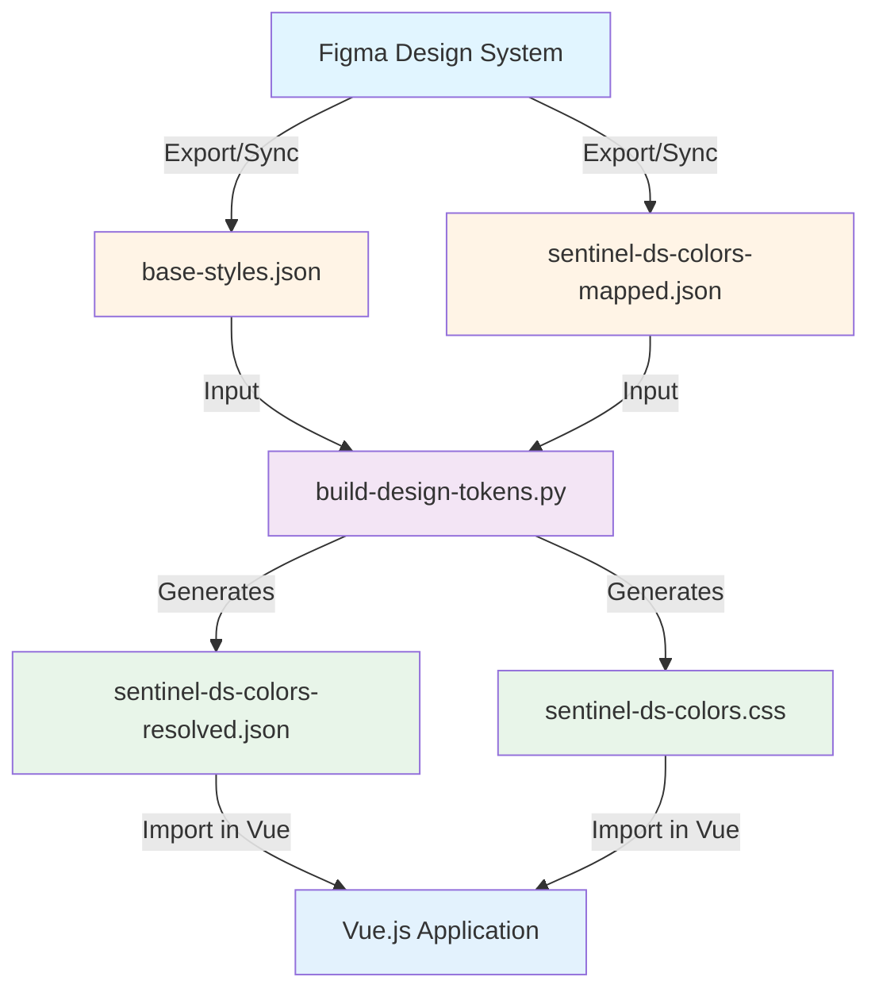

# Sentinel Design System - Color Tokens

A comprehensive color token system for the Sentinel design system, supporting light and dark themes with Figma sync. This repository bridges the gap between design (Figma) and development (Vue.js) by maintaining a single source of truth for all color definitions.

## 🎯 Overview

This design system uses a **two-layer token architecture**:

1. **Base Layer** (`base-styles.json`) - Foundation color palette with hex values
2. **Semantic Layer** (`sentinel-ds-colors-mapped.json`) - Theme-specific mappings (light/dark) that reference base colors

The system automatically generates developer-friendly files (resolved JSON and CSS) from these source files, ensuring designers and developers always stay in sync.

## 📁 File Structure

```
📦 sentinel-ds-26
├── 📄 base-styles.json                      # 🎨 Source 1: All color hex definitions
├── 📄 sentinel-ds-colors-mapped.json        # 🎨 Source 2: Theme mappings (Figma synced)
├── ✨ sentinel-ds-colors-resolved.json      # 🤖 Generated: Resolved hex values
├── ✨ sentinel-ds-colors.css                # 🤖 Generated: CSS custom properties
├── 🔧 build-design-tokens.py                # Build script (Python)
├── 🔧 build-design-tokens.js                # Build script (Node.js)
└── 📖 README.md                             # This file
```

### File Descriptions

| File | Type | Purpose | Edit? |
|------|------|---------|-------|
| `base-styles.json` | Source | All color hex values (e.g., `#F8FAFCFF`) | ✅ Yes (Figma synced) |
| `sentinel-ds-colors-mapped.json` | Source | Maps semantic tokens to base colors (e.g., `$Colors-Base-white`) | ✅ Yes (Figma synced) |
| `sentinel-ds-colors-resolved.json` | Generated | All variables resolved to hex values for JavaScript/Vue | ❌ No (auto-generated) |
| `sentinel-ds-colors.css` | Generated | CSS custom properties for themes | ❌ No (auto-generated) |
| `build-design-tokens.py` | Tool | Python script to regenerate files | ✅ Yes (if needed) |

## 🏗️ System Architecture

### How It Works

```
┌─────────────────────────────────────────────────────────────┐
│                         FIGMA                                │
│  Design tokens defined and exported                          │
└────────────────┬────────────────────────────────────────────┘
                 │ Sync
                 ▼
┌─────────────────────────────────────────────────────────────┐
│              SOURCE FILES (Git Repository)                   │
├─────────────────────────────────────────────────────────────┤
│                                                               │
│  📄 base-styles.json                                         │
│     ├─ colors.base.white: "#FFFFFFFF"                       │
│     ├─ colors.smoke.50: "#F8FAFCFF"                         │
│     └─ colors.text.text-one: "#121926FF"                    │
│                                                               │
│  📄 sentinel-ds-colors-mapped.json                          │
│     Light Theme:                                             │
│        ├─ bg.surface.primary: "$Colors-Smoke-50"            │
│        └─ text.primary: "$Colors-Text-text-one"             │
│     Dark Theme:                                              │
│        ├─ bg.surface.primary: "$Colors-Smoke-950"           │
│        └─ text.primary: "$Colors-Text-text-four"            │
│                                                               │
└────────────────┬────────────────────────────────────────────┘
                 │
                 │ Run: python3 build-design-tokens.py
                 │
                 ▼
┌─────────────────────────────────────────────────────────────┐
│            GENERATED FILES (For Developers)                  │
├─────────────────────────────────────────────────────────────┤
│                                                               │
│  ✨ sentinel-ds-colors-resolved.json                        │
│     Light Theme:                                             │
│        ├─ bg.surface.primary: "#F8FAFCFF"                   │
│        └─ text.primary: "#121926FF"                         │
│     Dark Theme:                                              │
│        ├─ bg.surface.primary: "#0D121CFF"                   │
│        └─ text.primary: "#CDD5DFFF"                         │
│                                                               │
│  ✨ sentinel-ds-colors.css                                  │
│     :root {                                                  │
│        --bg-surface-primary: #F8FAFCFF;                     │
│        --text-primary: #121926FF;                           │
│     }                                                        │
│     [data-theme="dark"] {                                   │
│        --bg-surface-primary: #0D121CFF;                     │
│        --text-primary: #CDD5DFFF;                           │
│     }                                                        │
│                                                               │
└────────────────┬────────────────────────────────────────────┘
                 │
                 ▼
┌─────────────────────────────────────────────────────────────┐
│                    VUE.JS APPLICATION                        │
│  Import and use tokens in components                         │
└─────────────────────────────────────────────────────────────┘
```

## 🚀 Getting Started

### For Designers (Figma → GitHub)

1. **Export from Figma**
   - Export color tokens from Figma to `base-styles.json` and `sentinel-ds-colors-mapped.json`
   - Ensure variable references (like `$Colors-Base-white`) are preserved in the mapped file

2. **Commit to Repository**
   ```bash
   git add base-styles.json sentinel-ds-colors-mapped.json
   git commit -m "Update design tokens from Figma"
   ```

3. **Regenerate Developer Files**
   ```bash
   python3 build-design-tokens.py
   ```

4. **Commit and Push Everything**
   ```bash
   git add sentinel-ds-colors-resolved.json sentinel-ds-colors.css
   git commit -m "Regenerate developer token files"
   git push origin main
   ```

### For Developers (GitHub → Vue)

1. **Clone Repository**
   ```bash
   git clone https://github.com/sean-s2/sentinel-ds-26.git
   ```

2. **Use the Generated Files**
   - Import `sentinel-ds-colors-resolved.json` for JavaScript/Vue
   - Or import `sentinel-ds-colors.css` for CSS custom properties

## 💻 For Developers (Vue.js)

### Installation

**Option A: Copy files directly to your project**
```bash
cp sentinel-ds-colors.css ./src/styles/
# or
cp sentinel-ds-colors-resolved.json ./src/tokens/
```

**Option B: Git submodule (recommended for teams)**
```bash
cd your-vue-project
git submodule add https://github.com/sean-s2/sentinel-ds-26.git design-tokens
```

### Quick Start

**Option 1: CSS Custom Properties (Recommended)**

```vue
<template>
  <div class="card">
    <h1 class="title">Hello World</h1>
  </div>
</template>

<style scoped>
@import './sentinel-ds-colors.css';

.card {
  background-color: var(--bg-surface-card);
  border: 1px solid var(--bg-surface-border);
  padding: var(--spacing-4);
}

.title {
  color: var(--text-primary);
}
</style>
```

**Option 2: Import JSON Directly**

```vue
<script setup>
import colors from './sentinel-ds-colors-resolved.json'

const theme = ref('light')
const bgColor = computed(() => colors[theme.value].bg.surface.primary)
</script>

<template>
  <div :style="{ backgroundColor: bgColor }">
    Content
  </div>
</template>
```

### Theme Switching

```vue
<script setup>
const theme = ref('light')

function toggleTheme() {
  theme.value = theme.value === 'light' ? 'dark' : 'light'
  document.documentElement.setAttribute('data-theme', theme.value)
}
</script>

<template>
  <button @click="toggleTheme">
    Toggle Theme
  </button>
</template>
```

### Available CSS Custom Properties

All tokens follow this naming pattern:

```css
/* Backgrounds */
--bg-surface-primary
--bg-surface-secondary
--bg-surface-card
--bg-surface-cell-hover

/* Text */
--text-primary
--text-secondary
--text-tertiary
--text-disabled

/* Actions */
--action-buttons-button-primary
--action-buttons-button-primary-hover
--action-checkbox-checkbox-selected

/* Alerts */
--alerts-info-bg
--alerts-error-bg
--alerts-warning-bg
--alerts-success-bg

/* Forms */
--form-input-input-enabled
--form-dropdown-dropdown-enabled

/* Badges */
--badge-badge-grey
--badge-badge-red
--badge-badge-blue

/* And many more... */
```

## 🔄 Complete Workflow

### Design Update Workflow (Figma → Developers)

```
1. Designer updates colors in Figma
   ↓
2. Export/sync to base-styles.json & sentinel-ds-colors-mapped.json
   ↓
3. Run build script: python3 build-design-tokens.py
   ↓
4. Commit all files (source + generated)
   ↓
5. Push to GitHub
   ↓
6. Developers pull changes and get new tokens automatically
```

### Step-by-Step Process

**When colors change in Figma:**

```bash
# 1. Sync Figma changes to JSON files
# (This happens through your Figma export process)

# 2. Navigate to the design tokens directory
cd "/path/to/ds colors"

# 3. Run the build script to regenerate developer files
python3 build-design-tokens.py

# Output:
# 🎨 Building design tokens...
# ✅ Generated: sentinel-ds-colors-resolved.json
# ✅ Generated: sentinel-ds-colors.css
# 🎉 Build complete!

# 4. Review changes
git status
git diff sentinel-ds-colors-resolved.json

# 5. Commit all changes (both source and generated files)
git add -A
git commit -m "Update color tokens: [describe changes]"

# 6. Push to repository
git push origin main

# 7. Notify developers to pull latest tokens
```

**Developers pulling updates:**

```bash
# In your Vue project
git pull origin main

# Or if using submodule
cd design-tokens
git pull origin main
cd ..
git add design-tokens
git commit -m "Update design tokens to latest version"
```

## 🔄 Keeping Files Synced

### When to Regenerate

Run the build script whenever you:
- Update `base-styles.json` (change hex colors)
- Update `sentinel-ds-colors-mapped.json` (change theme mappings)
- Pull changes from Figma

### How to Regenerate

**Using Python (recommended):**
```bash
python3 build-design-tokens.py
```

**Using Node.js:**
```bash
node build-design-tokens.js
```

**Output:**
```
🎨 Building design tokens...

✅ Generated: sentinel-ds-colors-resolved.json
✅ Generated: sentinel-ds-colors.css

🎉 Build complete!
```

### Automated Sync (Optional)

Add a pre-commit hook to auto-regenerate files:

```bash
# .git/hooks/pre-commit
#!/bin/bash
python3 build-design-tokens.py
git add sentinel-ds-colors-resolved.json sentinel-ds-colors.css
```

## 📊 Token Structure

### Light Theme Example
```json
{
  "light": {
    "bg": {
      "surface": {
        "primary": "#F8FAFCFF",
        "secondary": "#FCFCFDFF",
        "card": "#FFFFFFFF"
      }
    },
    "text": {
      "primary": "#121926FF",
      "secondary": "#4B5565FF"
    }
  }
}
```

### Dark Theme Example
```json
{
  "dark": {
    "bg": {
      "surface": {
        "primary": "#0D121CFF",
        "secondary": "#121926FF",
        "card": "#364152FF"
      }
    },
    "text": {
      "primary": "#CDD5DFFF",
      "secondary": "#9AA4B2FF"
    }
  }
}
```

## 🚨 Important Notes

### DO NOT EDIT
- ❌ `sentinel-ds-colors-resolved.json` - Auto-generated
- ❌ `sentinel-ds-colors.css` - Auto-generated

### SAFE TO EDIT
- ✅ `base-styles.json` - Source color definitions
- ✅ `sentinel-ds-colors-mapped.json` - Theme mappings (synced with Figma)

### Figma Sync Warning

⚠️ **Critical:** The `sentinel-ds-colors-mapped.json` file contains variable references (like `$Colors-Base-white`) that are connected to Figma's token system. 

**Do not manually edit** the variable reference format. Always use Figma's export function to update this file, as manual edits may break the sync between Figma and your codebase.

### Why Two Files (Mapped + Resolved)?

**`sentinel-ds-colors-mapped.json`** (Source - Figma synced)
- Contains variable references: `"primary": "$Colors-Smoke-50"`
- Maintains link to Figma design tokens
- Easier to update when base colors change
- Human-readable semantic mappings

**`sentinel-ds-colors-resolved.json`** (Generated - Developer use)
- Contains actual hex values: `"primary": "#F8FAFCFF"`
- Works directly in JavaScript/Vue without preprocessing
- No build step needed in Vue application
- Smaller runtime footprint

This separation ensures Figma sync stays intact while giving developers clean, ready-to-use tokens.

## 🔗 File Relationships



**Text Diagram:**
```
                     FIGMA
                       │
                       │ Export/Sync
                       ▼
        ┌──────────────┴──────────────┐
        │                              │
        ▼                              ▼
  base-styles.json         sentinel-ds-colors-mapped.json
  (Hex values)             (Variable references)
  Figma Sync ✓             Figma Sync ✓
        │                              │
        └──────────────┬───────────────┘
                       │
                       ▼
           [build-design-tokens.py]
                       │
        ┌──────────────┴──────────────┐
        │                              │
        ▼                              ▼
  sentinel-ds-colors-         sentinel-ds-colors.css
  resolved.json               (CSS custom properties)
  (Resolved hex values)       FOR DEVELOPERS ✨
  FOR DEVELOPERS ✨
        │                              │
        └──────────────┬───────────────┘
                       │
                       ▼
              Vue.js Application
```

## 🛠️ TypeScript Support (Optional)

For better type safety, create a types file:

```typescript
// types/design-tokens.ts
import colors from '../sentinel-ds-colors-resolved.json'

export type Theme = 'light' | 'dark'
export type ColorTokens = typeof colors.light

// Usage:
const bgColor: string = colors.light.bg.surface.primary
```

## 📝 Version History

- **v1.0.0** - Initial release with light and dark themes
- Auto-generated files include version metadata

## 🤝 Contributing

### Design Changes (Designers)
1. Update colors in Figma
2. Export to `base-styles.json` and `sentinel-ds-colors-mapped.json`
3. Run `python3 build-design-tokens.py`
4. Commit all files (source + generated)
5. Push to GitHub
6. Notify development team

### Development Integration (Developers)
1. Pull latest changes from repository
2. Import updated token files into Vue project
3. Test theme switching and color updates
4. Report any issues back to design team

### Build Script Updates
If you need to modify the build script logic:
1. Edit `build-design-tokens.py` (or `.js`)
2. Test with: `python3 build-design-tokens.py`
3. Verify generated files are correct
4. Commit script changes

## 🐛 Troubleshooting

### "Could not resolve variable" warnings

If you see warnings like:
```
⚠️  Warning: Could not resolve variable: $Colors-New-Color
```

**Solution:**
1. Check that the color exists in `base-styles.json`
2. Verify the variable name matches exactly (case-sensitive)
3. Ensure the color is properly nested in the JSON structure

### Figma sync broken

**Symptoms:** Figma shows errors or can't import tokens

**Solution:**
1. Do NOT manually edit `sentinel-ds-colors-mapped.json`
2. Always use Figma's export function
3. Check that variable references start with `$` and follow the pattern `$Colors-Category-name`

### Generated files not updating

**Solution:**
```bash
# Force regeneration
rm sentinel-ds-colors-resolved.json sentinel-ds-colors.css
python3 build-design-tokens.py
```

### Vue not picking up new colors

**Solution:**
1. Clear Vue dev server cache
2. Hard refresh browser (Cmd+Shift+R)
3. Verify you're importing the latest file
4. Check that CSS custom property names haven't changed

## 📞 Support

- **Repository:** https://github.com/sean-s2/sentinel-ds-26
- **Issues:** Report bugs or request features via GitHub Issues
- **Design Questions:** Contact the Sentinel design team

## 📝 Version History

- **v1.0.0** (2026-01-12)
  - Initial release with light and dark themes
  - Python and Node.js build scripts
  - CSS custom properties and JSON export
  - Figma sync integration

## 📄 License

Part of the Sentinel Design System.
